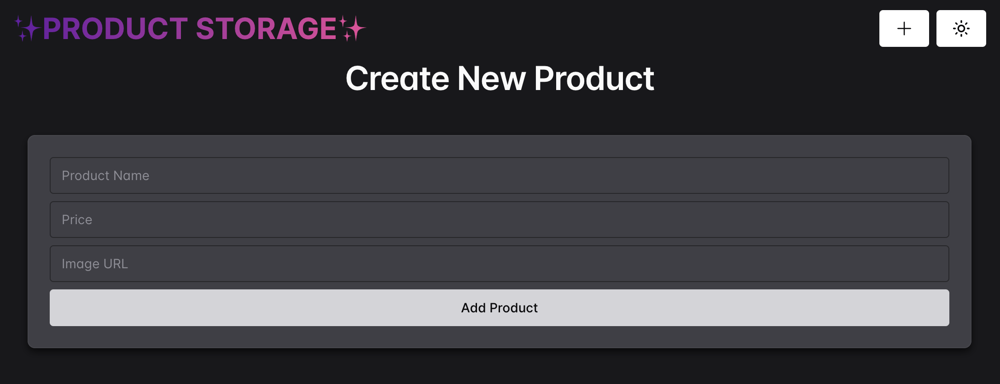
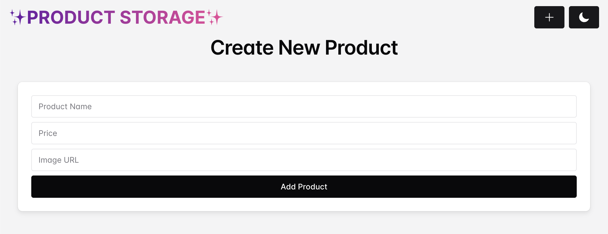

# product-storage-app

### Description
This is a simple MERN (MongoDB, Express, React, Node.js) app with a modular and maintainable codebase. The app allows users to create, update, and delete products in a seamless way.

## Table of Contents
1. [Web Framework](#Web-Framework)
2. [Database](#Database)
3. [Build Tools](#build-tools)
4. [UI component library](#ui-component-library)
5. [Features](#Features)
6. [Videos](#Videos)

## Web Framework

- **Express**

## Database

- **MongoDB**

## Build Tools

- **Vite**

## UI component library

- **Chakra UI**

## Features

- **Create Products:**  
  Users can add new products by providing the product name, price, and an image URL. After successfully creating a product, a success popup is displayed. If required fields are missing, a prompt appears asking the user to fill in all the fields.

- **Update Products:**  
  When a user updates a product from the list, the changes are updated both in the database and in the UI immediately.

- **Delete Products:**  
  Users can delete products from the list. Deletion is reflected both in the UI and in the database.

- **Dark Mode/Light Mode:**
 The application allows you to switch between dark and light themes, providing an optimal viewing experience in different lighting conditions and reducing eye strain.

## Videos

